# Network Equipment Overview / Желілік құрал-жабдықтарға шолу

Table - Network Equipment
| Device Type       | Model             | Vendor | Operating System |
|-------------------|-------------------|--------|------------------|
| L2 Switch         | S3710-H24P4S-A    | Huawei | VRP              |
| L3 Switch         | S5731-H24T4XC     | Huawei | VRP              |
| Router            | AR6140E-9G-2AC    | Huawei | VRP              |
| Firewall          | USG6610E          | Huawei | VRP              |
| Access Controller | AC6508            | Huawei | VRP              |
| Access Point      | AirEngine 6761-21 | Huawei | VRP              |


Table - Login Authentication
| interface/port    | Username | Password (1)   | Password (2)   |
|-------------------|----------|----------------|----------------|
| Console Port      | admin    | P@s$w0rd_&1234 | Huawei@123     |
| VTY (SSH, Telnet) | student  | P@s$w0rd_&1234 | Huawei@123     |


## Access Layer Switch: Huawei CloudEngine S3710-H24P4S-A

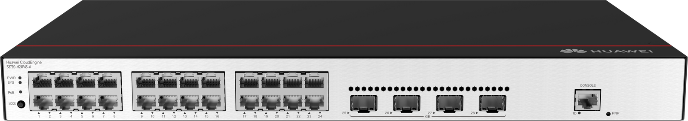

**Login authentication**

User interface con0 is available  

Please Press ENTER  

Please configure the login password (8-16)  
**Password:** P@s$w0rd_&1234  
**Confirm password:** P@s$w0rd_&1234  

**Info:** Save the password now. Please wait for a moment.  
**Info:** The max number of VTY users is 5, the number of current VTY users online is 0, and total number of terminal users online is 1.  
          The current login time is 2023-09-08 18:15:47.  

```shell
display version
```
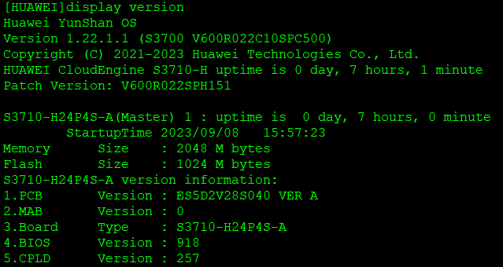

```shell
display interface brief
```
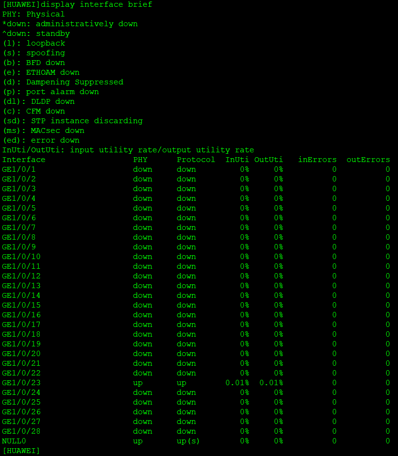

##  Core/Aggregation Layer Switch: Huawei CloudEngine S5731-H24T4XC

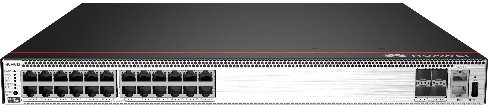

**Login authentication**

User interface con0 is available  

Please Press ENTER  

An initial password is required for the first login via the console.  
Set a password and keep it safe. Otherwise you will not be able to login via the console.  

Please configure the login password (8-16)  
**Enter Password:** P@s$w0rd_&1234  
**Confirm Password:** P@s$w0rd_&1234  

**Warning:** The authentication mode was changed to password authentication and the user level was changed to 15 on con0 at the first user login.  
**Warning:** There is a risk on the user-interface which you login through. Please change the configuration of the user-interface as soon as possible.  

**Info:** Smart-upgrade is currently disabled. Enable Smart-upgrade to get recommended version information.  

```shell
display version
```
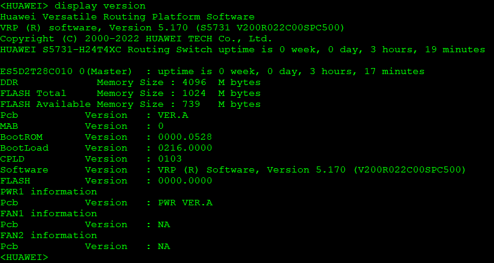

```shell
display interface brief
```
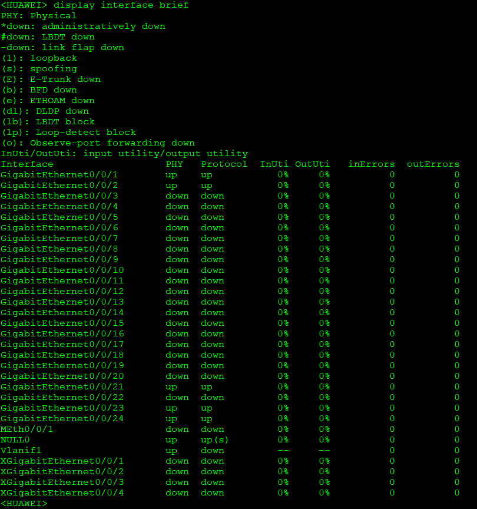

```shell
display ip interface brief
```
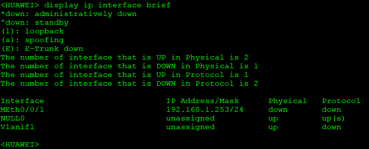

## Edge Router: Huawei NetEngine AR6140E-9G-2AC

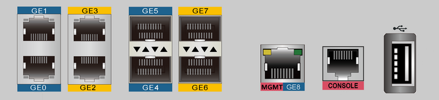
> Yellow - Layer 3 Routed Port  
> Blue - Layer 2 Switch Port  
> Red - Management (MGMT) Port  

**Login authentication**  

**Warning:** *An initial username and password are required for the first login via the console. Set a username and password and keep them safe. Otherwise you will not be able to login via the console.*  
**New Username:** admin  
**Password:** P@s$w0rd_&1234  
**Confirm password:** P@s$w0rd_&1234  
The account create success.  

**Info:** *Configuration console exit, please retry to log on*  

Login authentication  
**Username:** admin  
**Password:** P@s$w0rd_&1234  

**Warning:** *Auto-Config is working. Before configuring the device, stop Auto-Config. If you perform configurations when Auto-Config is running, the DHCP, routing, DNS, and VTY configurations will be lost. Do you want to **stop Auto-Config?** [y/n]:* **y**  
**Info:** *Auto-Config has been stopped.*  
<Huawei>  

```shell
display version
```
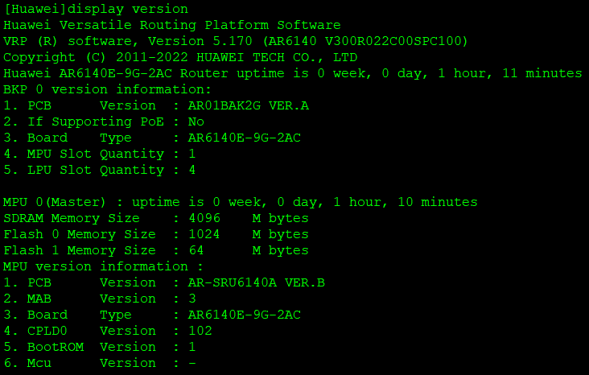

```shell
display interface brief
```
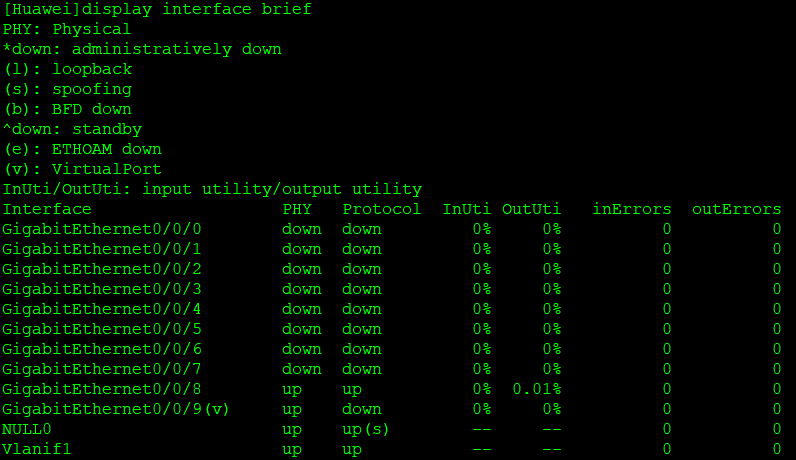

```shell
display ip interface brief
```
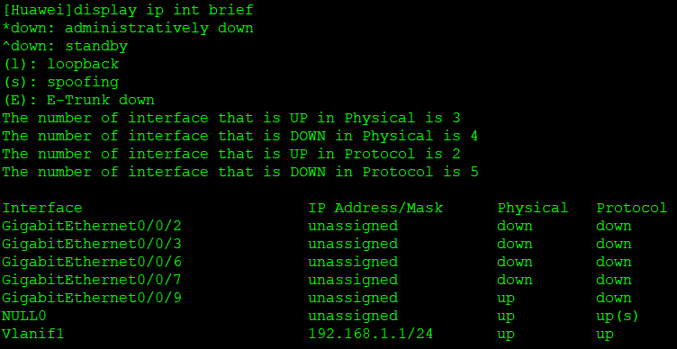

## Wireless Access Controller: Huawei AC6508
> Wireless LAN Access Point: AirEngine 6761-21  

```shell
display version
```

## Wireless Access Controller: Huawei HiSecEngine USG6000E

```shell
display version
```
