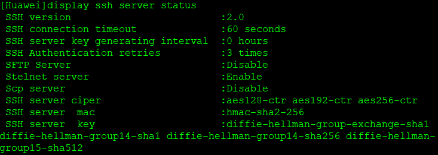

# Remote Access Configuration using SSH

### Edge Router: Huawei NetEngine AR6140E-9G-2AC


> Yellow - Layer 3 Routed Port  
> Blue - Layer 2 Switch Port  
> Red - Management (MGMT) Port  

*Төмендегі топологияда көрсетілгендей, A1 Switch (g1/0/17) пен EdgeR1 Router-ды (g0/0/8) Copper кабелмен байланыстырып қосамыз!*


```shell
display interface brief
```


```shell
display ip interface brief
```


**Create VLAN**
```shell
vlan 50
 name MGMT

display vlan brief
```

**Create VLANIF interface**
```shell
interface Vlanif50
 description MGMT
 ip address 10.1.50.1 255.255.255.0

display ip interface brief
```

**Access Port**
```shell
interface GigabitEthernet0/0/8
 description MGMT
 port link-type access
 port default vlan 50

display port vlan
display interface brief
```

**Configure Local User Authentication and Authorization**
```shell
aaa
 local-user student password irreversible-cipher P@s$w0rd_&1234
 local-user student privilege level 15
 local-user student service-type terminal ssh
```

> *жеке құқық (individual privilege) - student қолданушыға ғана тиесілі*  
> aaa  
> local-user student privilege level 15  

> жалпы құқық (Global privilege) - барлық қолданушыға қатысты  
> user-interface vty 0 4  
> user privilege level 15  

**Configure VTY Lines**
```shell
user-interface vty 0 4
 authentication-mode aaa
 protocol inbound ssh
```

**Generate RSA Key**
```shell
rsa local-key-pair create
 Warning: Confirm to replace them! Continue? [Y/N] Y
 Input the bits in the modulus[default = 2048]: 2048
```

**SSH server Permit interface**
```shell
ssh server permit interface Vlanif50
```

**Configure SSH User Settings**
```shell
ssh user student authentication-type password
```

**Enable SSH**
```shell
stelnet server enable
```
*Info: Succeeded in starting the STELNET server.*

```shell
display ssh server status
display current-configuration | include ssh
display current-configuration | include stelnet
```

