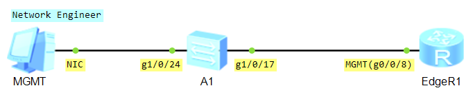
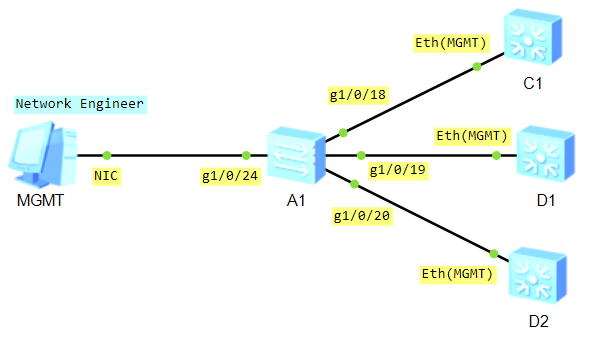

# Remote Access Configuration using SSH

> **ЕСКЕРТУ!** Бұл зертханалық жұмыс нақты физикалық құрылғыны (Physical Device) қолданып жасалған!  

### Step 1 – Edge Router (EdgeR1)


> Huawei NetEngine AR6140E-9G-2AC  

> Yellow - Layer 3 Routed Port  
> Blue - Layer 2 Switch Port  
> Red - Management (MGMT) Port  

Төмендегі топологияда көрсетілгендей, **A1 Switch (g1/0/17)** пен **EdgeR1 Router-ды (g0/0/8)** Copper кабелмен байланыстырып қосамыз!


**Configure Device Hostname**
```shell
<Huawei> system-view
[Huawei] sysname EdgeR1
[EdgeR1]
```

```shell
display interface brief
```


```shell
display ip interface brief
```


**Create VLAN**
```shell
vlan 50
 name MGMT

display vlan brief
```

**Create VLANIF interface**
```shell
interface Vlanif 50
 description MGMT
 ip address 10.1.50.1 255.255.255.0

display ip interface brief
```

**Configure Access Port**
```shell
interface GigabitEthernet0/0/8
 description MGMT
 port link-type access
 port default vlan 50

display port vlan
display interface brief
```

**SSH server Permit interface**
```shell
ssh server permit interface Vlanif 50
```

**Enable SSH**
```shell
[EdgeR1] stelnet server enable
Info: Succeeded in starting the STELNET server
```

```shell
display ssh server status
```


**Generate RSA Key**
```shell
rsa local-key-pair create
 Warning: Confirm to replace them! Continue? [Y/N] Y
 Input the bits in the modulus[default = 2048]: 2048

display rsa local-key-pair public
```

**Configure Local User Authentication and Authorization**
```shell
aaa
 local-user student password irreversible-cipher P@s$w0rd_&1234
 local-user student privilege level 15
 local-user student service-type terminal ssh
```

> ***жеке құқық (individual privilege) - student қолданушыға ғана тиесілі***  
> aaa  
>  local-user student privilege level 15  

> ***жалпы құқық (Global privilege) - барлық қолданушыға қатысты***  
> user-interface vty 0 4  
>  user privilege level 15  

**Configure SSH User Settings**
```shell
ssh user student authentication-type password
```
> Global Settings  
> ssh user default-authentication-type password  

**Configure VTY Lines**
```shell
user-interface vty 0 4
 authentication-mode aaa
 protocol inbound ssh
```

```shell
display cu | include ssh
```

### Step 2 – Core/Aggregation Layer Switch (C1, D1, D2, D3) 


> Huawei CloudEngine S5731-H24T4XC  

Төмендегі топологияда көрсетілгендей, **A1 Switch** пен **C1, D1, D2 Switch-терді** Copper кабелмен байланыстырып қосамыз!


**Configure Device Hostname**
```shell
<Huawei> system-view
[Huawei] sysname C1
[EdgeR1]
```

```shell
display interface brief
```


```shell
display ip interface brief
```


```shell
interface MEth0/0/1
 ip address 10.1.50.11 255.255.255.0

display ip interface brief
```

**SSH server Permit interface**
```shell
ssh server-source -i MEth0/0/1
```

**Enable SSH**
```shell
stelnet server enable
display ssh server status
```

**Generate RSA Key**
```shell
rsa local-key-pair create
 Warning: Confirm to replace them! Continue? [Y/N] Y
 Input the bits in the modulus[default = 2048]: 2048

display rsa local-key-pair public
```

**Configure Local User Authentication and Authorization**
```shell
aaa
 local-user student password irreversible-cipher P@s$w0rd_&1234
 local-user student privilege level 15
 local-user student service-type terminal ssh
```

**Configure SSH User Settings**
```shell
ssh user student
ssh user student authentication-type password
ssh user student service-type stelnet
```
> ssh client first-time enable  

**Configure VTY Lines**
```shell
user-interface vty 0 4
 authentication-mode aaa
 protocol inbound ssh
```

```shell
display cu | include ssh
```

### Step 3 – Access Layer Switch (A1, A2)


> Huawei CloudEngine S3710-H24P4S-A  

```shell
display interface brief
```

