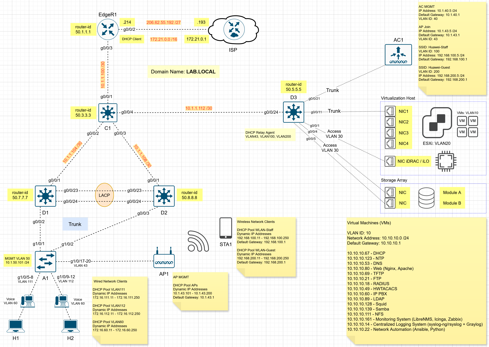

# Huawei-Based Enterprise Network Design and Implementation / Huawei құрылғылары негізінде корпоративті желіні жобалау және конфигурациялау

> **ЕСКЕРТУ!** Бұл зертханалық жұмыс нақты физикалық құрылғыны (Physical Device) қолданып жасалған!  

### Network Topology
  

| Device         | Role                                   |
| ---------------| ---------------------------------------|
| ISP            | ISP (Internet Service Provider) Router |
| EdgeR1         | Edge Router                            |
| С1             | Core Layer Switch                      |
| D1, D2, D3     | Aggregation Layer Switch               |
| A1, A2         | Access Layer Switch                    |
| H1, H2, H3, H4 | End Device                             |

## Scenario
1) Configure VLAN (Create VLANs and Access/Trunk Ports)  
   Link Aggregation. Eth-Trunk  
   MSTP (Multiple Spanning Tree Protocol)  
2) VRRP (Virtual Router Redundancy Protocol)
3) Single-Area OSPF
4) DHCP
5) NAT (Easy IP)
6) Remote Access (SSH, Telnet)

## Step 1 – Configure VLAN (Create VLANs and Access/Trunk Ports)

**A1 and A2 Switch**

```shell
# Create VLANs
vlan batch 50 111 112

vlan 50
 name MGMT

interface Vlanif50
 ip address 10.1.50.101 255.255.255.0

display vlan
```

```shell
# Configure Access Port

interface g1/0/5
 port link-type access
 port default vlan 111
 quit

interface g1/0/9
 port link-type access
 port default vlan 112
 quit

display vlan
display port vlan
```

```shell
# Configure Trunk Port and Allowed VLANs

interface g1/0/1
 port link-type trunk
 port trunk allow-pass vlan 111 112
 quit

interface g1/0/2
 port link-type trunk
 port trunk allow-pass vlan 111 112
 quit

display vlan
display port vlan
```

```shell
stp region-configuration
 region-name HQ
 revision-level 1
 instance 1 vlan 111
 instance 2 vlan 112
```

**D1 and D2 Switch**

```shell
# Create VLANs
vlan batch 111 112

interface Vlanif111
 ip address 172.16.111.1 255.255.255.0
 vrrp vrid 1 virtual-ip 172.16.111.254
 vrrp vrid 1 priority 110
 dhcp select relay
 dhcp relay server-ip 10.10.10.67

interface Vlanif112
 ip address 172.16.112.1 255.255.255.0
 vrrp vrid 2 virtual-ip 172.16.112.254
 dhcp select relay
 dhcp relay server-ip 10.10.10.67

display vlan
```

```shell
(D1) 
interface MEth0/0/1
 ip address 10.1.50.21 255.255.255.0

(D2)
interface MEth0/0/1
 ip address 10.1.50.22 255.255.255.0
```

```shell
# Configure Trunk Port and Allowed VLANs

(D1)
interface g0/0/2
 port link-type trunk
 port trunk allow-pass vlan 111 112
 quit

(D2)
interface g0/0/3
 port link-type trunk
 port trunk allow-pass vlan 111 112
 quit

display vlan
display port vlan
```

```shell
stp region-configuration
 region-name HQ
 revision-level 1
 instance 1 vlan 111
 instance 2 vlan 112
 active region-configuration
```

**D3 Switch**

```shell
# Create VLANs
vlan 10
 quit

vlan 20
 quit

interface Vlan10
 ip address 10.10.10.1 255.255.255.0

interface Vlan20
 ip address 172.20.20.1 255.255.255.0

show vlan
```

```shell
# Configure Trunk Port

interface GigabitEthernet0/2
 switchport trunk encapsulation dot1q
 switchport trunk allowed vlan 10,20
 switchport mode trunk

show vlan
show port vlan
```

```shell
interface GigabitEthernet0/1
 no switchport
 ip address 10.1.1.114 255.255.255.252
```

## Step 2 – Configure Link Aggregation. Eth-Trunk

**D1 and D2 Switch**

```shell
interface Eth-Trunk 1                                          // Create Eth-Trunk interface
 port link-type trunk                                          // Trunk Port
 port trunk allow-pass vlan 111 112                            // Allowed VLANs         
 mode lacp-static                                              // Link Aggregation Mode
 quit
```

```shell
# Add a Port to the Eth-Trunk

interface g0/0/23
 eth-trunk 1
 quit
interface g0/0/24
 eth-trunk 1
 quit

display int brief
```

```shell
# Verify Configuration

display eth-trunk 1
```
**C1 Switch**

```shell
interface MEth0/0/1
 ip address 10.1.50.11 255.255.255.0
```

**EdgeR1 Router**

```shell
vlan 50
 name MGMT

interface Vlanif50
 ip address 10.1.50.1 255.255.255.0
```

```shell
# Configure Access Port

interface GigabitEthernet0/0/8
 port link-type access
 port default vlan 50
```
